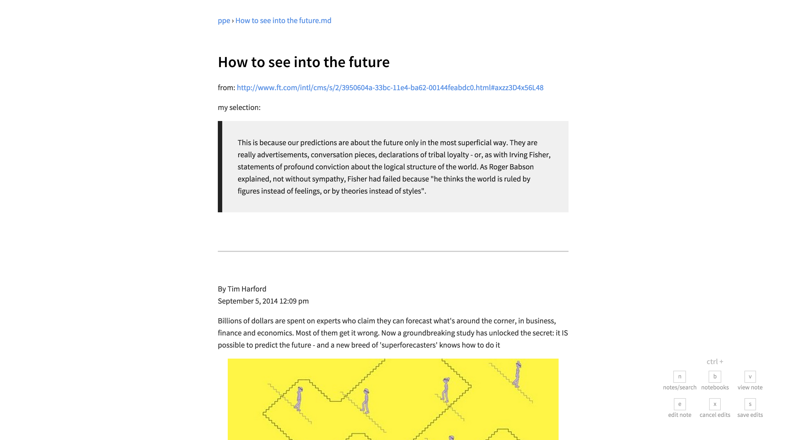
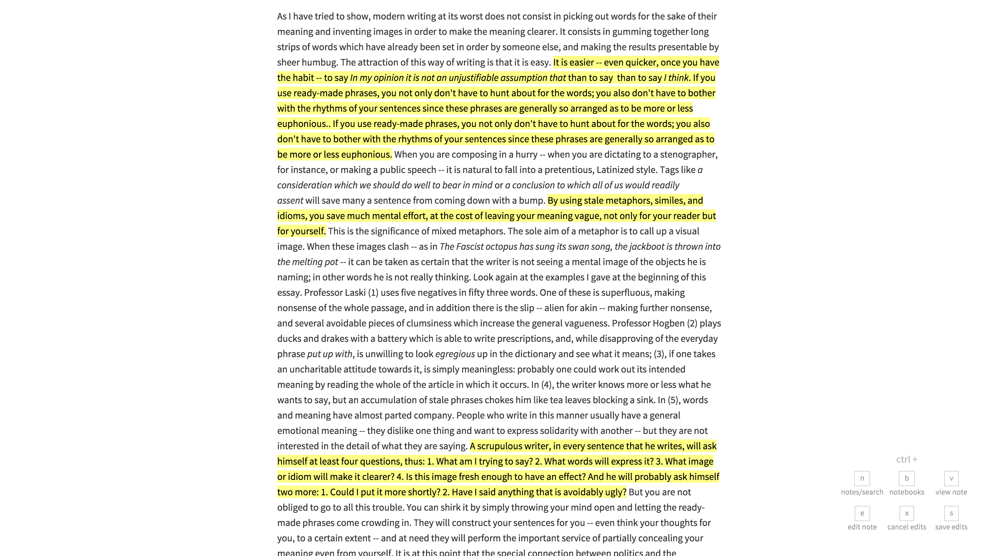

# nomadic


(more screenshots at the end)

I wasn't able to find a satisfactory way to use Evernote in Linux,
which led me to reconsider my Evernote usage in general.

`nomadic` leverages other tools I use daily to create a replacement
for my Evernote usage.


`nomadic` supports a simple directory structure of HTML, Markdown, txt, and
pdf notes and any other files which may need to be referenced. `nomadic`
provides an easier way of searching through and browsing those files
through either the command line or a simple web interface.

For example:

```bash
notes
├── economics
│   ├── more economics notes.pdf
│   ├── my economics notes.md
│   └── _resources
│       └── some image.png
├── programming
│   └── scala guide.html
└── some note.md
```

I recommend using `nomadic` with [BitTorrent Sync](www.bittorrent.com/sync) to keep
notes synced across devices. With this setup, `nomadic` becomes a decentralized,
simplified alternative to Evernote.

Since `nomadic` runs a small server for browsing files, you can access your notes remotely
that way as well.

Power users of Evernote might find it lacking but it's not for them :)

---

## Features

* Supports **GitHub-Flavored** Markdown
* Supports **MathJax** syntax
* Supports **references to images** and other files, and will automatically
update those references if the files are moved
* **Full-text search** (across html, txt, markdown, and even pdf files)
* A **rich text editor** (in-browser) for dumping in web clippings (external
        images are automatically saved locally)
* The rich text editor can **convert and save HTML notes into Markdown**
* **Auto-recompiling of Markdown** notes and updating of whatever browser is
viewing the note (i.e. live-ish previews)
* Serves **a browsable site of all your notes**
* Complete **command-line interface**
* Export notes as portable **presentations**

---

## Setup

### Installation
```bash
$ git clone https://github.com/ftzeng/nomadic.git
$ cd nomadic
$ pip install .

# Install front-end packages.
$ cd nomadic/server/assets/
$ bower install

# Build the highlight.js library.
$ cd static/vendor/highlight
$ npm install
# ...with all languages
$ node tools/build.js
# ...or with only specific languages
$ node tools/build.js python ruby javascript scala java bash http sql cs cpp css json objectivec xml markdown apache nginx
```

### Configuration
Create a config file (optional) at `~/.nomadic` in JSON format. See
[Configuration](#configuration) for more details.
If you don't create this config file, `nomadic` will create one for
you.


### The Daemon
The daemon watches your notes directory and automatically updates
the index as they change.
It will also automatically update references to other notes as they
change.

The daemon also runs a small server which allows for
easy browsing/searching through notes as well as a quick way
of previewing notes as you work on them.

#### To get the `nomadic` daemon to run automatically on startup...

##### Linux (Upstart)
If you're on a Linux distro that uses Upstart, you can do:

```bash
$ sudo cp scripts/nomadic.conf /etc/init/nomadic.conf
```

Then you can start the daemon:

```bash
$ sudo start nomadic
```

##### OSX
If you're on OSX, you can do:

```bash
$ cp scripts/com.nomadic.plist ~/Library/LaunchAgents/com.nomadic.plist
```

Then you can start the daemon:

```bash
$ launchctl load ~/Library/LaunchAgents/com.nomadic.plist
```

---

## Configuration
`nomadic` checks for a configuration at `~/.nomadic`. If you
start `nomadic` without a config, one will be created for you.

For example:

```json
{
    "root": "~/Notes",
    "default_notebook": "scratch"
}
```

Whenever you change this file, you must restart
the `nomadic` daemon:

```bash
# Linux (Upstart)
$ sudo restart nomadic

# OSX (there might be a better way)
$ pkill -f nomadic-d
$ launchctl start com.nomadic
```

### Custom CSS
You can specify a custom stylesheet to override the default one.
In your config, specify the path to that stylesheet:

```json
{
    ...
    "override_stylesheet": "~/path/to/my/styles.css"
    ...
}
```


---

## Usage
Run the `nomadic` daemon if it isn't running already.

```bash
$ nomadic-d
```


Primary interaction with `nomadic` is through
the command line.

```bash
$ nomadic --help

Usage: nomadic [OPTIONS] COMMAND [ARGS]...

Options:
  --help  Show this message and exit.

Commands:
  browse               Browse through notes via a web browser.
  clean                Removes unreferenced resource folders from a...
  convert              Convert an HTML note into a Markdown note and...
  count                Get the number of notes.
  export_presentation  Export a note as a portable presentation.
  index                Update or reset the note index.
  new                  Create a new note.
  search               Search through notes.
```

### Browsing notes
You can browse this notes site by running:

```bash
$ nomadic browse
```

which opens up the root directory ('notebook') in your
default web browser.

You can immediately jump to a specific notebook by
passing its name in:

```bash
$ nomadic browse economics
```

If the specified name matches multiple notebooks,
you'll be given the option to select the right one.

### Searching notes
The `nomadic` daemon will maintain a search index
for your notes as you update them.

You can search through your notes by running:
```bash
$ nomadic search <query>
```

This will present a list of results, along with snippets where the
keyword was found, for you to choose from.

`nomadic` can search through HTML, Markdown, txt, and pdf
files.

### Adding other files (images, etc)
If you are going to be referencing other files in your notes,
you should put them in a directory called `_resources` in
that note's notebook directory. `nomadic` recognizes these
directories and handles them specially.

### Presentations
You can export a note to a presentation format pretty easily.
For example:

```bash
$ nomadic export_presentation path/to/some_note.md ~/Desktop/
```

This compiles the note to the specified folder, copying over images. The presentation
can be opened in any browser.

The compiled HTML includes a script which breaks the note into slides according
to `<hr>` tags (specified in Markdown as `---`, `***`, or `___`). Slides resize to take
up the full window height, and any slides that are too tall are automatically scaled down.
You can use the up/down arrow keys to navigate.

### Tips

- You can view the 20 most recently modified notes using the `/recent/` path in the web browser.

---

## Development
```bash
$ git clone https://github.com/ftzeng/nomadic.git
$ cd nomadic
$ pip install --editable .
```

This installs the package locally, allowing you to work on it and test
it easily.

To run the included tests:
```bash
$ pip install nose
$ nosetests test
```

## Acknowledgements
The CSS stylesheet used for the compiled notes is based on the one from [here](https://gist.github.com/tuzz/3331384).


## Screenshots

#### blockquotes and images


#### embedded pdfs


#### you can copy and paste articles easily through the web editor


#### highlighting support


#### nice images


#### code and mathjax galore
